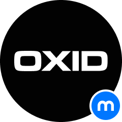

<p align="center">
  
</p>
<h1 align="center" style="margin-bottom: 40px;">Mollie for OXID eShop</h1>

Download the [Mollie](https://www.mollie.com/) module for OXID eShop. Mollie is a payment service provider (PSP) which provides your online store with the most popular online payment methods. 

Receive payments from European customers with ease. Mollie provides payment methods at higly competitive rates. Only pay per transaction and no hidden fees.

Choose the best payment provider available for your online OXID eShop. Create your merchant account at [Mollie.com](https://www.mollie.com/). 
Download and install the Mollie OXID eShop payment module and start receiving online payments now!

## Manual Installation
1. Create the folder "mollie" in the "source/modules" folder of the Oxid 6 installation
2. Create the folder "molliepayment" in the new "source/modules/mollie" folder of the Oxid 6 installation
3. Copy the content of this Git repository in this newly created "molliepayment" folder.
4. In the composer.json file in the base folder of the shop add the autoload configuration or extend if already existing:
```
  "autoload": {
    "psr-4": {
      "Mollie\\Payment\\": "./source/modules/mollie/molliepayment"
    },
    "files": ["./source/modules/mollie/molliepayment/lib/mollie-api-php/vendor/autoload.php"]
  },
```
5. Connect to the webserver with a console, navigate to the shop base folder and execute the following command to regenerate the autoloader files:
```
vendor/bin/composer dump-autoload
```
6. Log in to the shop admin area and enable and configure the module

# Supported payment methods

### Credit card
[Credit card](https://www.mollie.com/en/payments/credit-card) is virtually the best-known method for receiving payments with global coverage. 

Because [Mollie](https://www.mollie.com/) supports the biggest credit card brands like Mastercard, VISA and American Express, your store will attract a lot more potential buyers.

### Klarna: Pay later
[Klarna: Pay later](https://www.mollie.com/en/payments/klarna-pay-later). Klarna is a flexible payment solution, which allows your customers various, flexible, ways to pay. 

With Mollie you can integrate Klarna: Pay later quickly and start processing payments right away. 

### Klarna: Slice it
[Klarna: Slice it](https://www.mollie.com/en/payments/klarna-slice-it). Klarna is a flexible payment solution, which allows your customers various, flexible, ways to pay. 

With Mollie you can integrate Klarna: Slice it quickly and start processing payments right away.

### PayPal
[PayPal](https://www.mollie.com/en/payments/paypal) is a very popular payment method which is used worldwide. In a just few clicks, you can receive payments by bank transfer, credit card or PayPal balance.

### SOFORT Banking
[SOFORT Banking](https://www.mollie.com/en/payments/sofort) is one of the most popular payment methods in Germany and active in 9 European countries:

Germany, Belgium, the Netherlands, Italy, Austria, Poland, Switzerland, Spain and the United Kingdom.

Payments are direct, non-reversible and this payment method opens up a huge market potential for your online store.

### Giropay
[Giropay](https://www.mollie.com/en/payments/giropay). Giropay is a popular bank transfer payment method in Germany. 

It uses more than 1,500 German banks, which makes it a trusted payment method under German customers.

### EPS
[EPS](https://www.mollie.com/en/payments/eps). The Electronic Payment Standard (EPS) is a payment method, developed by various Austrian banks. 

This makes EPS the main bank transfer payment method in Austria and highly popular with Austrian shoppers. 

### Bank transfers
[Bank transfers](https://www.mollie.com/en/payments/bank-transfer) received in the SEPA zone via [Mollie](https://www.mollie.com/). This allows you to receive payments from both individuals and business customers in more than 35 European countries.

### iDeal 

[iDEAL](https://www.mollie.com/en/payments/ideal) makes paying for your online purchases safe, secure and easy.
iDEAL is a Dutch payment system which links customers directly to their online banking program when making an online purchase.

[Mollie](https://www.mollie.com/) makes it easy to connect with iDEAL,  without the usual technical and administrative hassle.
Mollie gives you access to your transaction overviews and other statistics at any time. It is also possible to receive a notification by e-mail or SMS after every successful payment.

[Mollie](https://www.mollie.com/) is the perfect partner for recieving iDEAL payments and it is not surprising that [Mollie](https://www.mollie.com/) provides iDEAL payments 
for more than 40,000 websites.

### Bancontact
[Bancontact](https://www.mollie.com/en/payments/bancontact) uses a physical card that is linked to credit on a Belgian bank account. Payments via Bancontact / Mister Cash are guaranteed and strongly resemble the iDEAL payment system for the Netherlands.

Because payments are guaranteed, this payment method is a huge surplus for your online store.

### ING Home’Pay
[ING Home’Pay](https://www.mollie.com/en/payments/ing-homepay). Mollie allows you to quickly and easily accept payments with ING Home'Pay.

It only takes 10 minutes to start receiving payments and there are no hidden fees involved, you only pay for successful transactions.

### paysafecard
[paysafecard](https://www.mollie.com/en/payments/paysafecard) is the most popular prepaid card for online payments. With paysafecard you can receive prepaid payments from 43 countries.

### KBC/CBC Payment Button
The [KBC / CBC Payment Button](https://www.mollie.com/en/payments/kbc-cbc) is an online payment method for KBC and CBC customers, together the largest bank in Belgium. 

KBC focuses on Flanders and CBC on Wallonia.

### Belfius Pay Button
[Belfius](https://www.mollie.com/en/payments/belfius) is one of the largest banks in Belgium. By introducing the Belfius Pay Button, the bank provides its customers with their own payment solution.

### Giftcard

Smartcards that allow the giver to charge them with a desired amount.

Mollie allows you to quickly and easily accepts payments through [gift cards](https://www.mollie.com/en/payments/gift-cards) from the most used suppliers. It only takes 10 minutes to start receiving payments and there are no hidden fees involved, you only pay for successful transactions.
